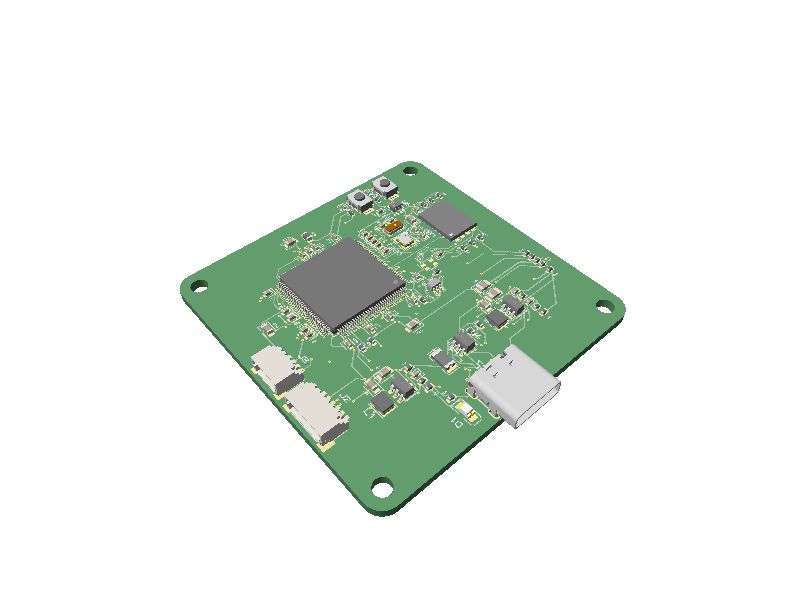
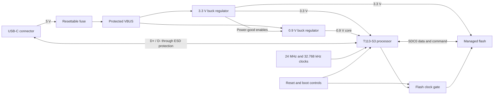

# Trellis Core

A compact, four-layer Linux board designed with [tscircuit](https://tscircuit.com/) around the Allwinner T113-S3 application processor.



[PCB layout](./__snapshots__/index.circuit-pcb.snap.svg) · [Schematic](./__snapshots__/index.circuit-schematic.snap.svg) · [3D view](./__snapshots__/index.circuit-3d.snap.png)

## Overview

Trellis Core combines the processor, managed flash, power supplies, clocks, USB-C interface, and boot controls required for a small Linux-capable system. The complete schematic, component placement, connectivity, and autorouter configuration are written in TypeScript and JSX, making the board easy to inspect and modify as code.

## Hardware

| Block | Implementation |
| --- | --- |
| Processor | Allwinner T113-S3 application processor |
| Power input | 5 V through USB-C with resettable-fuse protection |
| Main rails | 3.3 V system rail and sequenced 0.9 V core rail |
| Auxiliary rails | 1.8 V and 1.5 V generated by the processor's internal regulators |
| Storage | Managed flash connected through the processor's four-bit SDC0 interface |
| USB | USB 2.0 data with ESD protection and USB-C configuration resistors |
| Clocks | 24 MHz main crystal and 32.768 kHz low-frequency crystal |
| Controls | Processor reset, boot selection, board identification, and flash clock control |
| PCB | 50 mm × 50 mm, four layers, 1.6 mm thick, four 2.7 mm mounting holes |
| Routing | Four-layer autorouting with `5x` effort, 0.2 mm traces, and 0.2 mm minimum via holes |

## How it works



1. The USB-C connector supplies 5 V power and USB 2.0 data. A resettable fuse protects the power path, while an ESD protection device sits between the connector and the processor's USB pins.
2. The first buck regulator creates the 3.3 V system rail. Its power-good output enables the second regulator so the 0.9 V processor core rail starts in sequence.
3. The processor uses its internal regulators for the 1.8 V and 1.5 V auxiliary rails. Local capacitors provide decoupling for every power domain.
4. The 24 MHz crystal provides the main clock and the 32.768 kHz crystal provides the low-frequency clock used by the processor.
5. Managed flash connects to the processor over the four-bit SDC0 bus. A logic gate, pull-ups, and a pushbutton network control the storage clock during boot and recovery.
6. Reset, boot-selection, and board-identification resistor networks define the startup state. After placement, tscircuit autoroutes the board across all four copper layers.

## Uses

- A starting point for compact Linux-based controllers and USB-connected embedded devices
- A reference design for T113-S3 power sequencing, clocking, storage, and USB integration
- An example of describing a dense processor board entirely in tscircuit and TypeScript
- A test project for PCB placement, autorouting, 3D rendering, and manufacturing-export workflows
- A base design that can be extended with application-specific connectors and processor I/O

The current board focuses on the processor core, power, USB, and storage. Most application I/O is not broken out, so product-specific interfaces should be added before using it as a complete end product.

## Getting started

Install [Bun](https://bun.sh/), then run:

```sh
bun install
bun run dev
```

`bun run dev` opens the interactive tscircuit viewer, where the schematic, PCB, and 3D assembly can be inspected.

## Commands

| Command | Purpose |
| --- | --- |
| `bun run dev` | Open the interactive tscircuit viewer |
| `bun run typecheck` | Check the TypeScript source |
| `bun run verify` | Run electrical, placement, routing, short-circuit, and build checks |
| `bun run build` | Generate circuit JSON under `dist/` |
| `bun run build:preview` | Generate PCB, schematic, and 3D preview images |
| `bun run build:handoff` | Generate KiCad, STEP, and GLB handoff files |
| `bun run snapshot:update` | Refresh checked PCB and schematic snapshots |
| `bun run snapshot:3d:update` | Refresh the checked 3D snapshot |

## Generated outputs

Build artifacts are written under `dist/`:

- `dist/index/circuit.json` contains the complete generated circuit
- Preview builds add PCB, schematic, and 3D images
- Handoff builds add a KiCad project archive, STEP model, and GLB models

## Project structure

```text
.
├── index.circuit.tsx      Board definition, connectivity, and placement
├── imports/               Component wrappers, footprints, and CAD models
├── __snapshots__/         Checked PCB, schematic, and 3D renders
├── tscircuit.config.json  Project entrypoint and build configuration
├── tsconfig.json          TypeScript configuration
└── package.json           Development, verification, and export commands
```

## Current status

- TypeScript and netlist checks pass with no errors
- PCB placement passes with zero DRC errors or warnings
- Four-layer autorouting is enabled and the build completes successfully
- The generated board contains 204 PCB traces and 146 vias
- No autorouting errors, trace errors, or copper shorts are detected

The schematic placement checker reports only optional trace-simplification suggestions. Before manufacturing, inspect the generated handoff files and run the board through a fabrication-specific DRC.
