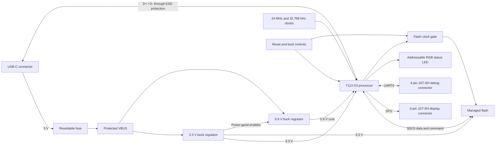

# Trellis Core

A compact, four-layer Linux board built around the Allwinner T113-S3 application processor.


## Overview

Trellis Core combines the processor, managed flash, power supplies, clocks, USB-C interface, boot controls, display expansion, debug UART, and a programmable status LED required for a small Linux-capable system. The complete schematic, component placement, connectivity, and autorouter configuration are written in TypeScript and JSX, making the board easy to inspect and modify as code.

## Hardware

| Block | Implementation |
| --- | --- |
| Processor | Allwinner T113-S3 application processor |
| Power input | 5 V through USB-C with resettable-fuse protection |
| Main rails | 3.3 V system rail and sequenced 0.9 V core rail |
| Auxiliary rails | 1.8 V and 1.5 V generated by the processor's internal regulators |
| Storage | ZDSD04GLGEAG 4 Gbit (512 MB) SD NAND on the four-bit SDC0 interface |
| USB | USB 2.0 data with ESD protection and USB-C configuration resistors |
| Clocks | 24 MHz main crystal and 32.768 kHz low-frequency crystal |
| Display expansion | SPI1 on a six-pin, 1 mm-pitch JST-SH connector |
| Debug | UART0 on a four-pin, 1 mm-pitch JST-SH connector |
| Status | 5 V XL-2121 addressable RGB LED driven through a 3.3 V-to-5 V AHCT buffer |
| Controls | Processor reset, boot selection, board identification, and flash clock control |
| PCB | 50 mm × 50 mm, four layers with an inner GND plane, 1.6 mm thick, four 2.7 mm mounting holes |
| Routing | Four-layer autorouting with `5x` effort, 0.2 mm traces, and 0.2 mm minimum via holes |

## How it works




1. The USB-C connector supplies 5 V power and USB 2.0 data. A resettable fuse protects the power path, while an ESD protection device sits between the connector and the processor's USB pins.
2. The first buck regulator creates the 3.3 V system rail. Its power-good output enables the second regulator so the 0.9 V processor core rail starts in sequence.
3. The processor uses its internal regulators for the 1.8 V and 1.5 V auxiliary rails. Local capacitors provide decoupling for every power domain.
4. The 24 MHz crystal provides the main clock and the 32.768 kHz crystal provides the low-frequency clock used by the processor.
5. Managed flash connects to the processor over the four-bit SDC0 bus. A logic gate, pull-ups, and a pushbutton network control the storage clock during boot and recovery.
6. SPI1 is broken out for a display, UART0 is available for a 3.3 V serial console, and the LEDC-capable PE5 pin drives the addressable RGB LED through U8 (SN74AHCT1G125) and a 33 Ω series resistor. U8 and the LED use protected VBUS; R27 holds the buffer input low during reset.
7. Reset, boot-selection, and board-identification resistor networks define the startup state. After placement, tscircuit autoroutes the board across all four copper layers.

## Expansion connectors

Both expansion connectors are JST-SH, 1 mm pitch. Pin numbering below follows the schematic and footprint definitions.

| J2 pin | SPI1 display signal | T113-S3 pin |
| --- | --- | --- |
| 1 | P3V3 | — |
| 2 | GND | — |
| 3 | SPI1_CLK | PD11 |
| 4 | SPI1_MOSI | PD12 |
| 5 | SPI1_MISO | PD13 |
| 6 | SPI1_CS0 | PD10 |

| J3 pin | UART0 debug signal | T113-S3 pin |
| --- | --- | --- |
| 1 | P3V3 | — |
| 2 | GND | — |
| 3 | UART0_TX | PE2 |
| 4 | UART0_RX | PE3 |

J3 uses 3.3 V logic. Use a 3.3 V USB-to-UART adapter, connect adapter RX to J3 TX and adapter TX to J3 RX, and do not apply 5 V to any J3 signal or power pin.

## How to program the board

The board is programmed through its existing USB-C data connector using the T113-S3 BootROM's USB FEL mode. No separate programmer IC is fitted or required for this flow. SW2 disables the managed-flash clock so the installed image can be bypassed during recovery, and SW1 resets the processor. The boot behavior and peripheral pin functions are documented in the [T113-S3 user manual](https://turl.linux-sunxi.org/T113-S3/T113-S3_User_manual_v1.1_20210830.pdf) and [datasheet](https://dl.linux-sunxi.org/T113-S3/T113-S3_Datasheet_v1.6_20220303.pdf).

### Programming theory

Every time the processor is reset, it starts by executing an immutable first-stage program from its internal BootROM. Under normal conditions, the `SD_FLASH_CLK_GATE_EN` pull-up enables U6, allowing the SDC0 clock to reach the managed flash so the BootROM can load the installed boot image.

R12/R13 pull BOOT_SEL1/0 high. In GPIO boot-select mode, `11` tries SMHC0 first (T113-S3 user manual, Table 3-7), matching the SD NAND connection. This assumes the CPU has not been configured for an overriding eFuse boot policy.

Holding SW2 pulls `SD_FLASH_CLK_GATE_EN` low. U6 then blocks the storage clock, preventing the managed flash from responding during the next boot. After SW1 resets the processor, the BootROM cannot boot the stored image and exposes its FEL recovery interface over the USB data lines connected to J1. The host-side XFEL tool communicates directly with this BootROM interface, which is why an additional programmer IC is unnecessary.

FEL initially provides only a small recovery environment. XFEL first loads the T113-S3 DDR initialization code and can then upload a temporary loader, recovery U-Boot, or flashing image into RAM. That temporary program writes the final bootloader and system image to managed flash. Release SW2 once FEL is detected, before the RAM loader accesses storage. This restores the storage clock without resetting the CPU; resetting after a successful write starts the newly programmed image. J3 UART0 is optional and is used for boot logs and debugging, not for transferring the firmware image.

### Programming procedure

Identify the buttons by their component references:

| Button | Function | When to use it |
| --- | --- | --- |
| **SW1 — RESET** | Resets the T113-S3 processor | Press and release while holding SW2 to start recovery, or after programming to reboot. |
| **SW2 — FEL / SD FLASH DISABLE** | Blocks the SD NAND clock while held | Hold during power-on/reset to bypass storage boot; release after FEL detection, before accessing storage. |

1. Optionally connect J3 GND/TX/RX to a 3.3 V USB-to-UART adapter. Leave the adapter's power pin disconnected when USB-C powers the board.
2. Hold **SW2 (FEL)**, connect a USB-C **data** cable to the host, then press and release **SW1 (RESET)** while continuing to hold SW2. This powers and resets the CPU with the SD NAND clock blocked.
3. Run `xfel version` and confirm FEL detection. **Release SW2 (FEL) now**, without resetting, so a RAM loader can access the SD NAND.
4. Run `xfel ddr t113-s3`, then load a T113-S3 recovery image that supports this board's SDC0 pinout and SD NAND. No tested recovery image or partition layout is included in this repository.
5. Use that image's SD/MMC storage-writing procedure, verify the write, and reset with **SW1 (RESET)**. XFEL's `spinand` commands target SPI NAND and do not program this SDC0-attached part.

This is the intended hardware recovery path, verified against the netlist and component documentation. FEL entry, DDR initialization, and storage writes still need testing on a physical board with a compatible recovery image.

See the [XFEL quick start](https://xfel.xboot.org/en/guide/getting-started/) for host setup and RAM-loading examples; its [T113 implementation](https://github.com/xboot/xfel/blob/master/chips/r528_t113.c) provides the `t113-s3` DDR profile. Storage write offsets are image-specific and should not be guessed.

## RGB control

U7 is powered by protected 5 V VBUS. Its [manufacturer datasheet](https://datasheet.lcsc.com/datasheet/pdf/2df1f2a44ad21337c86deb2773c9b36b.pdf) specifies full operation at 4.5–5.5 V and a DIN high threshold of 0.65 × VDD. U8's [TTL-compatible input](https://www.ti.com/lit/ds/symlink/sn74ahct1g125.pdf) accepts the CPU's 3.3 V output and drives DIN at the LED supply voltage. C45 and C46 bypass the LED and buffer separately. Configure PE5 for LEDC-DO and use the LED's single-wire protocol; WLED firmware is not included.

## Decoupling and review checks

The [decoupling map](scripts/decoupling-map.json) lists every local bypass capacitor, its exact IC power/reference pin, and its maximum routed length. Each `DECOUPLE_C*` trace has a dedicated physical path. Top-layer paths have a 3 mm ceiling; the six bottom-layer CPU bypasses have a 4 mm ceiling that includes the 1.6 mm through-via. Capacitor pin 1 faces the IC. Each pin 2 has a dedicated return of at most 1 mm to a nearby through-via tied to the inner GND plane. `decouplingFor` remains on each capacitor for inspection; an explicit trace supplies the physical route, so `decouplingTo` is intentionally omitted to avoid duplicate generated traces.

`bun run check:decoupling` measures the built copper polyline, including both sides of vias and via depth. It fails for missing/wrong pin mappings, missing direct routes, ungrounded capacitors, changed limits, excessive length, or any build errors (the CLI can otherwise return success despite routing errors). It is part of `bun run verify`. These are board layout constraints, not a substitute for power-integrity measurements.

The remaining capacitors have different roles: C3/C5/C6 are regulator output reservoirs; C10/C22/C29 are rail bulk storage; C2/C4 are feedback feed-forward capacitors; C8 is the power-good filter; C32/C33/C36/C37 are crystal loads; C40 is the reset filter; C44 filters the flash-clock enable. They are not counted as local IC bypasses.

The schematic uses power-marked rails, a standard USB-C connector symbol, and crystal symbols for OSC1/OSC2. Signal nets with voltage text in their names are explicitly classified to keep their labels correct. Net labels and power/ground symbols are generated automatically; this project does not use manual `<netlabel>` elements. The expansion sheet groups the populated SPI/UART connectors, boot straps, and RGB circuitry; CPU power and bypasses remain together on CPU Core.

## Uses

- A starting point for compact Linux-based controllers and USB-connected embedded devices
- A reference design for T113-S3 power sequencing, clocking, storage, and USB integration
- An example of describing a dense processor board entirely in tscircuit and TypeScript
- A test project for PCB placement, autorouting, 3D rendering, and manufacturing-export workflows
- A base design with SPI display and UART debug expansion for application-specific firmware

The current board focuses on the processor core, power, USB, storage, a compact SPI display bus, and serial debug. Additional product-specific I/O may still be needed before using it as a complete end product.

## Getting started

Install [Bun](https://bun.sh/), then run:

```sh
bun install
bun run dev
```

`bun run dev` opens the interactive tscircuit viewer, where the schematic, PCB, and 3D assembly can be inspected.

## Commands

| Command | Purpose |
| --- | --- |
| `bun run dev` | Open the interactive tscircuit viewer |
| `bun run typecheck` | Check the TypeScript source |
| `bun run verify` | Run netlist, placement, build, actual decoupling length, and copper-short checks |
| `bun run check:decoupling` | Check local bypass routes in the existing build |
| `bun run build` | Generate circuit JSON under `dist/` |
| `bun run build:preview` | Generate PCB, schematic, and 3D preview images |
| `bun run build:handoff` | Generate KiCad, STEP, and GLB handoff files |
| `bun run snapshot:update` | Refresh checked PCB and schematic snapshots |
| `bun run snapshot:3d:update` | Refresh the checked 3D snapshot |

## Generated outputs

Build artifacts are written under `dist/`:

- `dist/index/circuit.json` contains the complete generated circuit
- Preview builds add PCB, schematic, and 3D images
- Handoff builds add a KiCad project archive, STEP model, and GLB models

## Project structure

```text
.
├── index.circuit.tsx      Board definition, connectivity, and placement
├── imports/               Component wrappers, footprints, and CAD models
├── __snapshots__/         Checked PCB, schematic, and 3D renders
├── tscircuit.config.json  Project entrypoint and build configuration
├── tsconfig.json          TypeScript configuration
└── package.json           Development, verification, and export commands
```

## Current status

Run `bun run verify` to reproduce the electrical, placement, routed decoupling, and copper-short checks. Checked schematic, PCB, and 3D views are stored in `__snapshots__/`.

Hardware bring-up and a compatible recovery/flashing image remain unverified. Inspect the generated handoff files and run fabrication-specific DRC before manufacturing.
